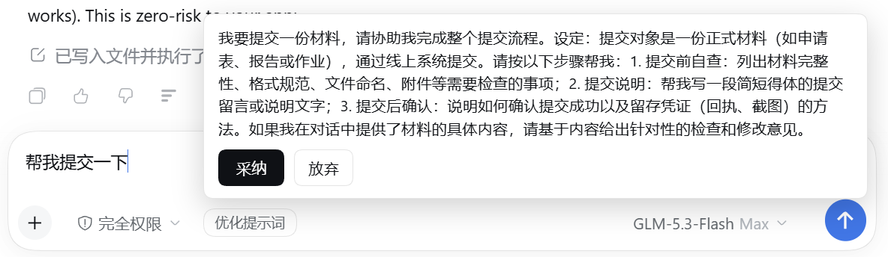
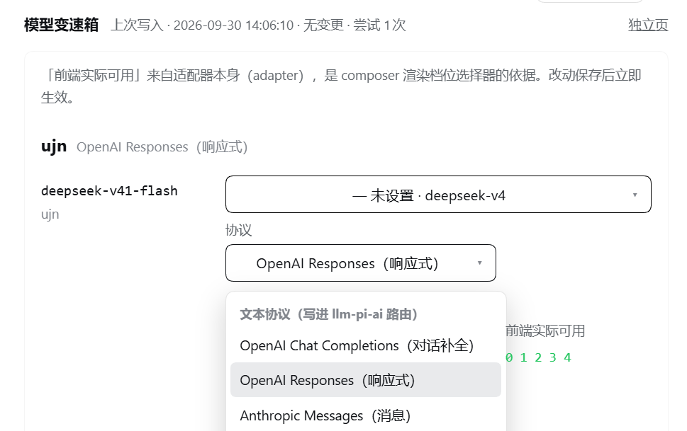

# dsh-gearbox · 模型变速箱

**DeepSeek Harness (DSH) 插件：第三方模型的思考档位预设、按模型切换协议，以及输入框内的提示词优化。**

> DSH 对第三方模型只提供"有没有思考"级别的控制，且**不感知各家的思考档位参数**。
> 本插件把这件事做完整：按「厂家 → 模型」组织官方档位预设，一键应用到任意第三方供应商，
> 并支持按模型切换通信协议、在输入框内一键优化提示词。

| 输入条优化 | 设置 → 模型变速箱 |
|---|---|
|  |  |

## 功能

### 1. 思考档位预设（Effort Studio）

- **16 组官方档位预设**，按「厂家 → 模型」两级组织（OpenAI / DeepSeek / Anthropic / Gemini /
  阿里云百炼 / 智谱 GLM / Kimi / xAI / OpenRouter）
- 每组预设只列**真实档位**：各家参数形态不同（OpenAI 扁平 `reasoning_effort`、DeepSeek
  `thinking:{type}` + 强度、Anthropic `output_config.effort`、百炼顶层 `enable_thinking`…），
  且**同一厂家内按型号收窄**——把会被网关映射掉的档位列出来就是给用户假档位
- 档位直写 `dsh-llm-pi-ai` 配置：写入前本地校验（`INVALID_CONFIG` 会否掉整次 config，坏规则单独拒绝）
- **自定义档位**：先选模式，再逐模式填传输值；找不到匹配预设时用
- 协议感知：`thinkingFormat` 只有 openai-completions 接受，按路由 `api` 自动裁剪并回报适配说明
- `customEfforts` / `customCompat` 真正接入解析（此前 schema 声明了但从未被消费）

### 2. 按模型切换协议

- 三种文本协议：`OpenAI Chat Completions` / `OpenAI Responses` / `Anthropic Messages`
- **协议是路由级字段**，按模型切换靠自动重新分组：模型移到目标协议的路由，
  其余路由自动克隆（`<route>-<后缀>`，复制 baseURL/凭据、只换 `api`），切回自动合并
- 设置页下拉按「文本协议（写进 llm-pi-ai 路由）」分组展示

### 3. 提示词优化

输入框里的「优化提示词」按钮：用你在设置里选的大模型，把输入框内容改写成更完整的提示词。

- 指令**内化** [LinqiuZz/Claude-prompt-skill-](https://github.com/LinqiuZz/Claude-prompt-skill-)
  （MIT，57 种提示词框架）的行为：诊断 → 按复杂度/领域匹配框架 → 补全 → 只输出最终提示词
- **简单任务不套复杂框架**（画个小狗就该给一句简短提示词，不是一整套角色/背景/约束模板）
- 点击 → 按钮转圈 → 面板展示优化结果 → **采纳**写回输入框 / **放弃**不改

### 4. 设置分节与独立页

- 设置 → 模型变速箱：原生渲染进外壳文档（无嵌套滚动），样式用外壳设计令牌 `--dsw-*`，深浅主题自适应
- `/gears/ui` 独立页：同一套后端，显示**运行中的真实状态**（配置的档位 vs 适配器实际对外提供的档位）

## 安装

```sh
dsh plugin --profile <name> add dsh-gearbox
```

要求：`package.json` 声明 `dsh.bundle`；官方包以 `peerDependencies` 引用（含预发布范围）。

## 使用

| 入口 | 位置 | 说明 |
|---|---|---|
| 设置 → 模型变速箱 | DSH 设置对话框 | 档位矩阵 + 优化模型选择，改动保存即生效 |
| `/gears/ui` | 插件自带网页 | 同一套后端的独立设置页 |
| composer 档位选择器 | 对话输入区 | 选模型后出现，档位由本插件配置决定 |
| 「优化提示词」按钮 | 对话输入区左下角 | 转圈 → 面板 → 采纳/放弃 |

HTTP API（`/gears/api/*`）：`info` / `presets` / `inventory` / `rules` / `validate` / `apply` /
`export` / `own-config` / `enhance` / `protocol`，供面板与脚本使用。

## 开发

```sh
# 跨盘 file: 链接的依赖闭包修复（开发插件必需）
node scripts/setup-dev-links.mjs

# 验证台：语法/schema/注册形状/写入校验/协议适配/客户端渲染（含带真实数据的分支）
node scripts/harness.mjs        # ALL CHECKS PASSED
```

结构：

```
dsh-gearbox/
├── lib/
│   ├── index.js            # 宿主半：apply / 档位写入 / HTTP API / 设置分节注册
│   ├── presets.js          # 16 组档位预设 + 协议适配与校验
│   ├── vendor-catalog.js   # 厂家 → 模型目录 + isThinkingCapable
│   ├── prompt-skill.js     # 内化的提示词优化技能指令
│   ├── client.js           # 客户端半：设置分节 + 输入条控件（经典 script，无 JSX）
│   ├── settings-page.js    # 独立设置页（自包含 HTML）
│   └── config.js           # Config schema（即设置面板）
└── scripts/harness.mjs     # 验证台
```

## 已知限制

- 插件**不做图像生成**（曾实现后移除；DSH 拒绝 assistant 图像块，图像模型也不能当对话模型）
- 协议切换只覆盖三种文本协议；`api` 在 llm-pi-ai 里是路由级字段，按模型切换靠自动重新分组实现
- 思考档位的写入目标是 `dsh-llm-pi-ai` 的配置；线上字段由其适配器按路由 `api` 翻译
